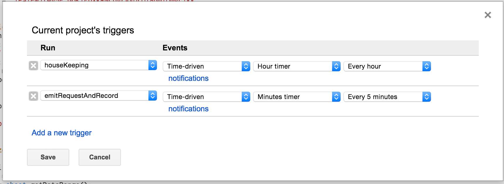
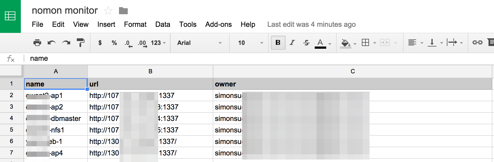
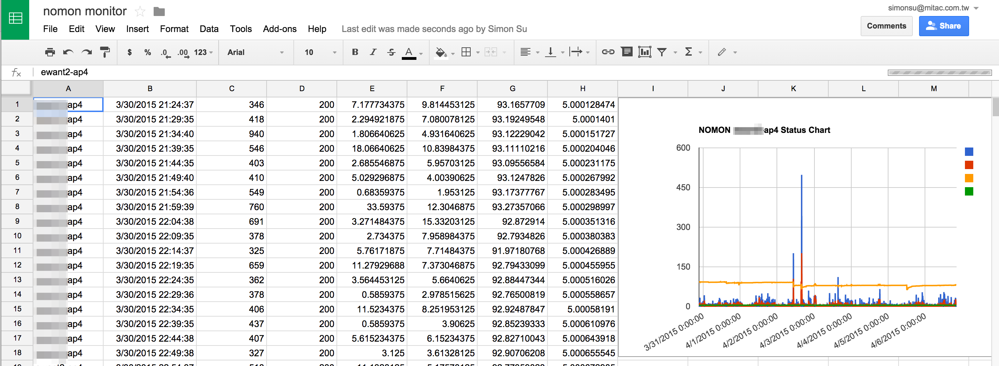

# apps-script-monitor

## Author: 

I am Simon Su (simonsu.mail@gmail.com) member of [GCPUG Taiwan](https://www.facebook.com/groups/GCPUG.TW). Currently, we follow GCPUG in Japan and want to share more Google's tecchnology to Taiwan's developers. 

## About this Script

This share our lightweight monitor tool using AppsScript in google sheet. It already integrate the calendar and email notification when monitor failed. You can also open the calendar's SMS notification function to receive the service unavabile notice.

## Server installation

In server side, we should install a daemon that run on port 1337 for present the cpu, memory, disk usages information.

```
curl https://raw.githubusercontent.com/micloud/nomon/master/install.sh | bash
```

## Create monitor script

* Create a google sheet then open the sheet apps script and past the content from "monitor-apps-script.js".
* Update the following informations

```
me = 'your@gmail.com',
calendarId = 'your-calendar-id@group.calendar.google.com',
sheetId = 'your-sheet-id',
cfg = {
  recipient: 'who-want-to-receive@gmail.com',
  subject: 'Notify Title', 
  ...}
```

  * me: Admin email address for receive error message
  * calendarId: The calendar ID. If binding the SMS notification to calendar, you can receive the SMS notify.
  * sheetId: The google spreadsheet id.
  * cfg.recipient: Who want to receive the admin notify, list the email spread by comma here.
  * cfg.subject: The notify email title.
  * 
* Setup the schedule from AppScript console.



* Setup the monitor list: Create a sheet tab named "Config", and write the monitor servers by the following format
  * name: This is the name of script to create a tab for collect the monitor data
  * url: The server monitor url
  * owner: The notification receivers.



After you setup done, you will see the machine name tab in the sheet. At the same time, the script start to collect the data. 


